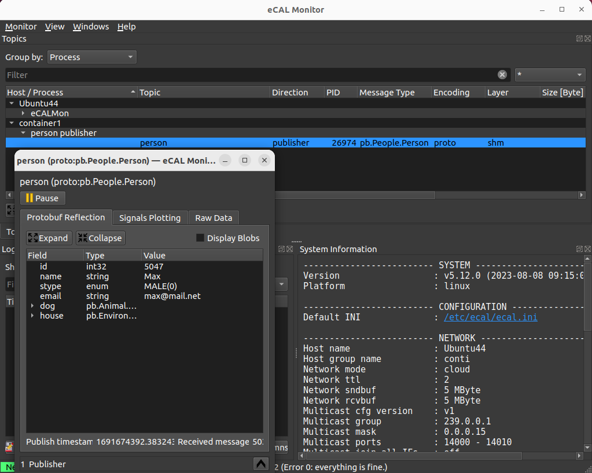
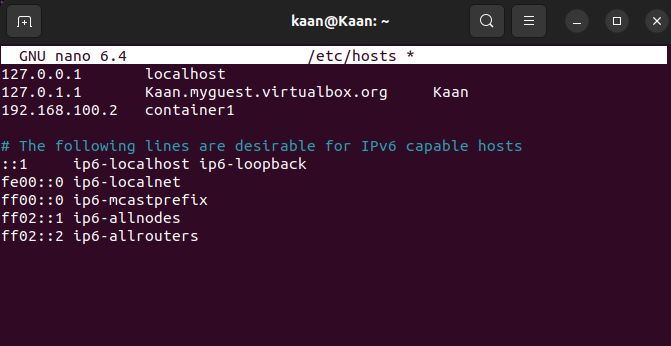

import { Aside } from "@astrojs/starlight/components";
import { Code } from 'astro-expressive-code/components';
import { FileTree } from '@astrojs/starlight/components';
import { Steps } from "@astrojs/starlight/components";

import runtimeDockerfile from '../../../../assets/files/eCAL_in_docker/eCAL_runtime_container/Dockerfile?raw'

import pubDockerfile from '../../../../assets/files/eCAL_in_docker/pub_container/Dockerfile?raw'
import sndCMakeListsTXT from '../../../../assets/files/hello_world/hello_world_snd/CMakeLists.txt?raw';
import sndMainCPP from '../../../../assets/files/hello_world/hello_world_snd/main.cpp?raw';

import subDockerfile from '../../../../assets/files/eCAL_in_docker/sub_container/Dockerfile?raw'
import recCMakeListsTXT from '../../../../assets/files/hello_world/hello_world_rec/CMakeLists.txt?raw';
import recMainCPP from '../../../../assets/files/hello_world/hello_world_rec/main.cpp?raw';

import dockerComposeYAML from '../../../../assets/files/eCAL_in_docker/docker-compose.yaml?raw'

Here we will show how to deploy eCAL into a docker container, and how to use its image from other containers.

<Aside type="caution" title="Important">
    This will work with eCAL 5.10 and up.
    Older eCAL versions will lack Shared Memory communication when being run in a docker container.
</Aside>  

## Prerequisite

- Install Docker as described in the [Docker installation documentation](https://docs.docker.com/engine/install/ubuntu/#install-using-the-repository) 
    <Aside type="tip">
     If you have problems regarding to the installation, check these links:
     - [Docker package not found](https://stackoverflow.com/questions/61401626/docker-installation-failed-on-ubuntu-20-04-ltsvmware)      
     - [Docker installation failed](https://forums.docker.com/t/cant-install-docker-on-ubuntu-20-04/93058)
    </Aside>

- Optional: If you want your docker container to talk to eCAL Nodes on other machines:
  Set up your [multicast routes](/getting_started/4_network_configuration/#422-multicast-configuration-on-ubuntu) on the host.

- Optional: If you want to use eCAL on your host to subscribe to data from your docker containers: [Install eCAL](/getting_started/2_installing_ecal/#22-installing-ecal-on-ubuntu) the host.

## Getting Started

In this tutorial we are going to create:

- A general purpose eCAL Docker container
- A publisher container with a custom Hello World Publisher
- A subscriber container receiving the Hello World data.

The file hierarchy that we are going to follow:
   
<FileTree>
- ecal_in_docker
    - <a href="https://eclipse-ecal.github.io/ecal/_downloads/304360402df9652a0869c7762bb50cdd/docker-compose.yaml" download>docker-compose.yaml</a>
    - ecal_runtime_container
        - <a href="https://eclipse-ecal.github.io/ecal/_downloads/1faac69541d517e0f0f35f41ebbd748d/Dockerfile" download>Dockerfile</a>
    - pub_container
        - <a href="https://eclipse-ecal.github.io/ecal/_downloads/fa5b06b870ebaeeac7d9094ce6f77e00/Dockerfile" download>Dockerfile</a>
        - <a href="https://eclipse-ecal.github.io/ecal/_downloads/de030105a2759ef0432ac8316a6e7deb/CMakeLists.txt" download>CMakeLists.txt</a>
        - <a href="https://eclipse-ecal.github.io/ecal/_downloads/e62ace93fccc50817f03e27c4f7a3163/main.cpp" download>main.cpp</a>
    - sub_container
        - <a href="https://eclipse-ecal.github.io/ecal/_downloads/4b443fc3edc84fe91ad82b8473385dfc/Dockerfile" download>Dockerfile</a>
        - <a href="https://eclipse-ecal.github.io/ecal/_downloads/7d3bda427fdf1fd3a0b98854060bba5f/CMakeLists.txt" download>CMakeLists.txt</a>
        - <a href="https://eclipse-ecal.github.io/ecal/_downloads/d0d86cc7199f2c4b757fe5543e8b6cfa/main.cpp" download>main.cpp</a>
</FileTree>

### eCAL runtime container
<Steps>
1. Create the file `ecal_runtime_container/Dockerfile` and paste the following installation commands:

   <Code code={runtimeDockerfile} lang="docker" title="Dockerfile"/>

2. Build the image:
    ```shell
        cd ecal_in_docker
        sudo docker build . --rm -t ecal-runtime
    ```

3. Test the image
    ```shell
        sudo docker run --rm -it --ipc=host --pid=host --network=host ecal-runtime
    ```

   At this point you are in the docker container.
   You can exit it with ``exit``.
   If you run ``ecal_sample_person_snd`` in the docker container and have an eCAL installation on your host, you can subscribe to the data via the eCAL Monitor or ``ecal_sample_person_rec``.
   <Aside>
      - ``--ipc=host`` will enable Shared Memory communication with your host system and other docker containers that are started with the same parameter.
        This is important for local communication.

      - ``--network=host`` will share the host's network.
        This is important for network communcation with other machines.
        It is also important for local shared memory communication, as it affects the hostname of the container.
        The hostname is used to determine whether an eCAL topic is avaialble via shared memory.

      - ``--pid=host`` will share the Process-ID range with the host.
        Otherwise processes from different containers may get the same Process ID, which will prevent communication between those two processes.
    </Aside>
</Steps>

### Publisher container

The publisher container will be built on top of the ``ecal-runtime`` container.
It will contain the Hello World Sample from the [Getting Started Section](/getting_started/7-development-c/7_1_hello_world/#712-hello-world-publisher).

<Steps>
1. Create a file `pub_container/Dockerfile` and paste the following content:
    <Code code={pubDockerfile} lang="docker" title="Dockerfile"/>

2. Create publisher source code: `pub_container/main.cpp`
    <Code code={sndMainCPP} lang="cpp" title="main.cpp"/>

3. Create file  `pub_container/CMakeLists.txt`
    <Code code={sndCMakeListsTXT} lang="cmake" title="CMakeLists.txt"/>

4. Build the image:
    ```shell
        cd pub_container
        sudo docker build . --rm -t ecal-publisher:1.0.0
    ```
</Steps>

### Subscriber container

The subscriber container will also be based on the ``ecal-runtime`` container and contain the Hello World Sample from the [Getting Started Section](/getting_started/7-development-c/7_1_hello_world/#713-hello-world-subscriber).

<Steps>
1. Create a file: `sub_container/Dockerfile`
    <Code code={subDockerfile} lang="docker" title="Dockerfile"/>

2. Create subscriber source code: `sub_container/main.cpp`
    <Code code={recMainCPP} lang="cpp" title="main.cpp"/>

3. Create file `sub_container/CMakeLists.txt`
    <Code code={recCMakeListsTXT} lang="cmake" title="CMakeLists.txt"/>
  
4. Build the image:
    ```shell
        cd sub_container
        sudo docker build . --rm -t ecal-subscriber:1.0.0
    ```
</Steps>

### Run the docker containers

- You can run the publisher and subscriber images manually with ``docker run``.
    ```shell
        sudo docker run --rm -it --ipc=host --network=host --pid=host ecal-subscriber:1.0.0
        sudo docker run --rm -it --ipc=host --network=host --pid=host ecal-publisher:1.0.0
    ```

- You can also use the docker-compose file to manage multiple containers.
  <Steps>
  1. In the parent folder create file `docker-compose.yaml` and paste the following content:
     <Code code={dockerComposeYAML} lang="yml" title="docker-compose.yaml"/>

  2. You can now use that docker-compose to build/run the publisher and subscriber containers:
        ```shell
            sudo docker-compose build
            sudo docker-compose up
        ```
  </Steps>

### Seamless IPC-Communication across host borders

<Aside type="caution" title="Important">
   This will work with eCAL 5.12 and higher.
   Older versions lack the ability to utilize the ``host_group_name`` in the `ecal.ini` file, thus it won't work.
</Aside>

In eCAL, you are able to set host belonging over network borders by utilizing the `ecal.ini` configuration file with the same ``host_group_name`` - in the following steps, you will learn how to set this up.

<Aside>
    If we don't set the same ``host_group_name`` on our Host and our Containers, an IPC-Communication across host borders is not available with different host names.
</Aside>

<Steps>
1. To encapsulate your container network from your host network, you need to create a new docker network with the following command:
    ```shell
      sudo docker network create --driver=bridge --subnet=10.0.10.0/24 my_network
    ```

2. Edit your `ecal.ini` and run your Container within the newly created docker network

   - You will use our previously discussed [ecal-runtime-image](#_top) for the next step.

   - First, open `/etc/ecal/ecal.ini` from your preferred editor.

   - Search for the line ``network_enabled`` and set it to ``true``.

   - Search for the line ``host_group_name`` and write your preferred name.

   - Save and close the `ecal.ini` file.

   - Now your `ecal.ini` file is prepared.
     We want to use it not only for our Host-System but also for our Container, so we don't need to edit the `ecal.ini` in our Container again.
     To achieve that, run following command to start your container:
    ```shell
        sudo docker run --rm -it --ipc=host --pid=host --network=my_network --name=container1 -h=container1 --ip=10.0.10.10 -v /etc/ecal/ecal.ini:/etc/ecal/ecal.ini ecal-runtime
    ```

   - You should now be inside the root shell of your Container. Check if your `ecal.ini` file is correct.

   - Now your Container is prepared and configured correctly, so we are ready to start an eCAL example.
    ```shell
        ecal_sample_person_snd
    ```


3. Configure the Host network

   - eCAL is sending UDP messages to a multicast IP group ``239.0.0.0/24``, further information in [Getting Started Section](/getting_started/4_network_configuration/#422-multicast-configuration-on-ubuntu). 
     The idea is now, to successfully receive those messages from your previously started container on your host.
     For that, you need to add a route to your routing table.
     By typing ``ifconfig`` in your shell, you can identify the right docker network.
     In our case, the prefix of the docker network is always ``br`` followed by random numbers. 
     After identifying the right network, run following command.
    ```shell
        sudo ip route add 239.0.0.0/24 dev <br-xxx> metric 1
    ```

   - Review your network configuration. Your eCAL-Monitor should resemble this example:
    


4. (optional) After adding the route, you register the Container with IP address and name in /etc/hosts for DNS resolution, enabling easy access to it by hostname within the network.
    ```shell
        sudo nano /etc/hosts
    ```
    
</Steps>

When you are done, all eCAL nodes can communicate seamlessly from docker to the host and vice versa.
