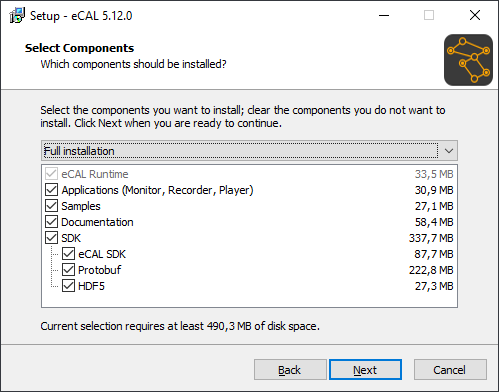

import { Icon } from 'astro-icon/components';
import { Aside } from '@astrojs/starlight/components';
import { Steps } from '@astrojs/starlight/components';
import { Tabs, TabItem } from '@astrojs/starlight/components';

Before using eCAL, you must install it on your PC.
This section covers how to install eCAL on Microsoft Windows and Ubuntu (both 64 bit only).
You can either use eCAL just on one PC (local communication) or on multiple PCs (cloud communication).
We will cover both scenarios in the next sections.

So, let's get started!

<Aside type="tip">If you are looking for a tutorial on how to build eCAL from source (e.g. to get it working on a non-supported OS) please refer to [Building eCAL from source](https://eclipse-ecal.github.io/ecal/development/building_ecal_from_source.html#development-building-ecal-from-source).</Aside>

## 2.1 Installing eCAL on Windows

<Steps>

1. Choose your desired eCAL Version from the [eCAL Download Archive](https://eclipse-ecal.github.io/ecal/_download_archive/download_archive.html#download-archive) and download the Windows installer.
   New users should download the latest Version.
   
2. Install eCAL with default options (Full installation):

</Steps>



## 2.2 Installing eCAL on Ubuntu

For Ubuntu, you can either install eCAL from a PPA (Personal Package Archive) or manually from debian files.
For most users, the PPA will provide the easiest way of installing eCAL.
The PPA also supports more Ubuntu Versions and CPU Architectures (x86, x64, arm64, armhf).

**Ubuntu 22.04 Users**:
You may experience issues with the GUI Applications (actually all Qt5 Apps) due to Ubuntus switch to wayland.
But you can [log in with X11](https://eclipse-ecal.github.io/ecal/faq.html#faq-ubuntu-22-04-graphical-issues), which solves those issues.

<Aside type="tip">Advanced users can also [compile eCAL from source](https://eclipse-ecal.github.io/ecal/development/building_ecal_from_source.html#development-building-ecal-from-source).</Aside>

### 2.2.1 Automatically install eCAL from a PPA

Installing eCAL from a PPA will cause apt-get to automatically update eCAL for you.
You can choose from different PPAs, depending on your desired upgrade path.

<Tabs>
  <TabItem label="Rolling Release">
    This is the rolling release PPA. It will always upgrade your installation and you will always receive the latest-and-greatest eCAL version.
    ```shell
    sudo add-apt-repository ppa:ecal/ecal-latest
    sudo apt-get update
    sudo apt-get install ecal
    ```
    Also check out this PPA on [Launchpad](https://launchpad.net/~ecal/+archive/ubuntu/ecal-latest)!
  </TabItem>
  <TabItem label="eCAL 5.13">
    This PPA will always stay on eCAL 5.13. You will receive patches as long as eCAL 5.13 is supported. If you want to upgrade to a new eCAL Version, you will have to manually add the new PPA.

    At the moment, eCAL 5.13 is the latest supported version.
    ```shell
    sudo add-apt-repository ppa:ecal/ecal-5.13
    sudo apt-get update
    sudo apt-get install ecal
    ```
    Also check out this PPA on [Launchpad](https://launchpad.net/~ecal/+archive/ubuntu/ecal-5.13)!
  </TabItem>
  <TabItem label="eCAL 5.12">
    This PPA will always stay on eCAL 5.12. You will receive patches as long as eCAL 5.12 is supported. If you want to upgrade to a new eCAL Version, you will have to manually add the new PPA.

    At the moment, eCAL 5.12 is the supported legacy-version. Support will be dropped when the next eCAL Version is released.
    ```shell
    sudo add-apt-repository ppa:ecal/ecal-5.12
    sudo apt-get update
    sudo apt-get install ecal
    ```
    Also check out this PPA on [Launchpad](https://launchpad.net/~ecal/+archive/ubuntu/ecal-5.12)!
  </TabItem>
  <TabItem label="eCAL 5.11">
    This PPA will always stay on eCAL 5.11. If you want to upgrade to a new eCAL Version, you will have to manually add the new PPA.

    eCAL 5.11 is not supported any more and will not receive patches. You can still use the PPA to install the latest eCAL 5.11. Please consider upgrading to a newer version.
    ```shell
    sudo add-apt-repository ppa:ecal/ecal-5.11
    sudo apt-get update
    sudo apt-get install ecal
    ```
    Also check out this PPA on [Launchpad](https://launchpad.net/~ecal/+archive/ubuntu/ecal-5.11)!
  </TabItem>
</Tabs>

### 2.2.2 Manually install eCAL from a .deb file

<Aside type="caution" title="Warning">We usually recommend installing from a PPA ([see above](#221-automatically-install-ecal-from-a-ppa)).</Aside>

<Steps>
1. Choose your desired eCAL Version from the [eCAL Download Archive](https://eclipse-ecal.github.io/ecal/_download_archive/download_archive.html#download-archive).

2. Install the eCAL Dependencies:

   - Ubuntu 18.04:

     ```shell
        sudo apt update
        sudo apt install libc6 libcurl4 libgcc1 libhdf5-100 libprotobuf10 libqt5core5a libqt5gui5 libqt5widgets5 libqt5svg5 libstdc++6 sysstat ifstat libqwt-qt5-6 libyaml-cpp0.5v5
     ```

   - Ubuntu 20.04:

     ```shell
        sudo apt update
        sudo apt install libc6 libcurl4 libgcc-s1 libhdf5-103 libprotobuf17 libqt5core5a libqt5gui5 libqt5widgets5 libqt5svg5 libstdc++6 sysstat ifstat libqwt-qt5-6 libyaml-cpp0.6
     ```

   - Ubuntu 22.04:

     ```shell
        sudo apt update
        sudo apt install libc6 libcurl4 libgcc-s1 libhdf5-103 libprotobuf23 libqt5core5a libqt5gui5 libqt5widgets5 libqt5svg5 libstdc++6 sysstat ifstat libqwt-qt5-6 libyaml-cpp0.7
     ```

3. Install the debian package:
    ```shell
      sudo dpkg -i ecal_*.deb
    ```
</Steps>