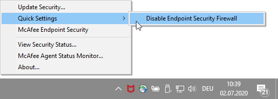
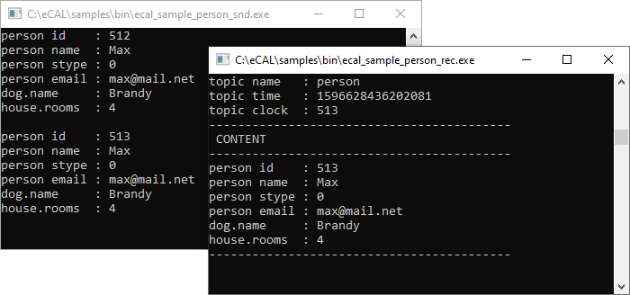

import { Aside } from '@astrojs/starlight/components';

The eCAL installation comes with a set of ready-to-use sample applications. So, let's start one of those to see some eCAL communication! 

<Aside>For now, you should start everything on the same PC. We will cover communication between multiple PCs in the next section.</Aside>

## 3.1 Basic communication

<Aside type="caution" title="Important">
   eCAL exchanges data over IP multicast.
   If you are using some third-party firewall, you may have to turn that off.

   
</Aside>

The sample we are going to use to try out the "normal" eCAL communication is *ecal_sample_person_snd*. Start it!

* On Windows start `C:\eCAL\samples\bin\ecal_sample_person_snd.exe`.
* On Ubuntu call `ecal_sample_person_snd` from a terminal (it should be in your PATH).

You now have a console-based application that periodically prints some text to the terminal. In the background the application created a topic *person* and sends data to it. So, let's add a subscriber that receives the data!

* On Windows start `C:\eCAL\samples\bin\ecal_sample_person_rec.exe`.
* On Ubuntu call `ecal_sample_person_rec` from a terminal.

Congratulations! You are looking at your first local eCAL communication! The subscriber subscribed to the topic *person* and prints all data it receives to the terminal.

<Aside type="tip">Start a second publisher and a second subscriber to see what happens! Both publishers will send their data to the same topic, so all subscribers will receive the data of all publishers.</Aside>