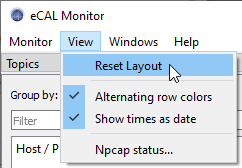
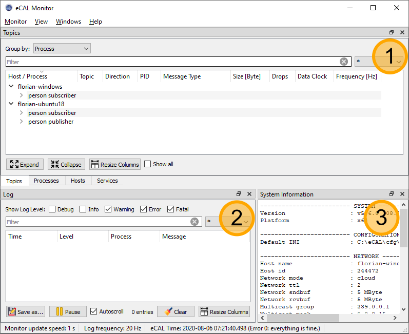
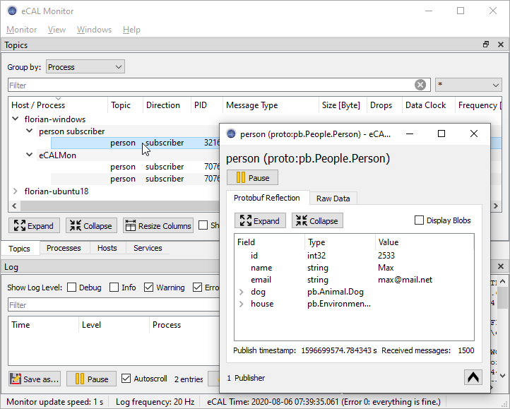
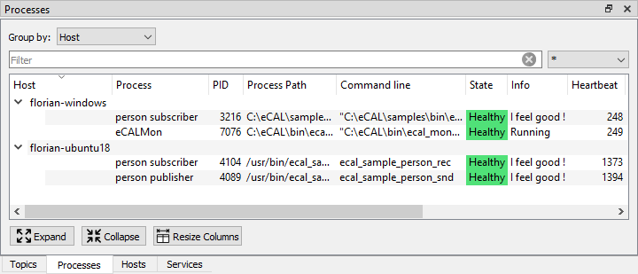
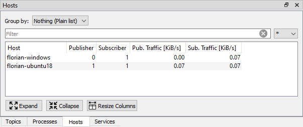

import { Aside } from "@astrojs/starlight/components";
import { Steps } from "@astrojs/starlight/components";

<Aside type="tip">
  Don't be afraid to play around with the GUI! If you closed or moved something
  and can't get it back, just click `View / Reset Layout`! 
  
</Aside>

The eCAL Monitor is a powerful debugging tool that comes with eCAL.

Its main features are:

- Displaying eCAL topics and showing who is publishing and subscribing
- Showing the content of eCAL messages
- Listing visible eCAL processes, hosts and services
- Showing log messages
- Showing information about your system and eCAL configuration

For the following overview, we are using the eCAL samples from the [previous section](/getting_started/3_ecal_samples/).
We have one _person_snd_ running on a remote Ubuntu machine and in total two _person_rec_ running on the remote and on the local machine.
You can replicate that setup yourself or just launch everything on your local PC, if you don't have two machines ready, yet.

Now start the eCAL Monitor!

- On Windows you can launch it from the Start Menu: `Start / eCAL / eCAL Monitor`
- On Ubuntu start `ecal_mon_gui` from a terminal

## 6.1.1 Overview

When you first start the monitor, you will get the following screen.
Let us walk through the main panels of the eCAL Monitor!

<Steps>

   1. **Topics panel**
   In the topics panel you can see the connections between all publishers to all subscribers.
   By default it is grouped by processes.
   Note that all of our samples are shown, one _person publisher_ on _florian-ubuntu_ and one _person subscriber_ on each _florian-windows_ and _florian-ubuntu_
   This is by far the most important panel and we will take a deeper look at it below.

   2. **Log panel**
   Here you can see log messages. All eCAL applications can print messages here, even if they run on another machine.
   Currently the log view is empty, as our sample applications don't log anything.

   3. **System information**
   Here you can see some useful information about your system and your eCAL configuration.
   You can also find the "cloud-configuration" setting we talked about in the [Network configuration](/getting_started/4_network_configuration/) section!

</Steps>

<Aside type="tip">
  If you ever see the "Error getting Monitoring Information" Error in the lower
  right corner, you may have to [turn off your
  firewall](/getting_started/3_ecal_samples/)! 
</Aside>

## 6.1.2 The Topics panel

You may have already noticed the 4 tabs below the topics panel. Let's go through all of them.

### 6.1.2.1 Topics

The Topics panel shows you all topics that exist in your eCAL network, including their publishers and subscribers.
You can expand the items to show the connections between them.

As you can see, we only have one topic *person* at the moment.
The data-type of that topic is a protobuf message, which means that eCAL can show you the content out of the box!
Double clicking one of the connection entries will open a window, that lets you see the content of all messages being sent to the *person* topic.

The eCAL Monitor ships with the ability to display Raw data as hexadecimal output, a tree-based representation of Google protobuf messages as well as ASCII-based string data.
Later you may have the need to visualize more complex messages (e.g. 3D point clouds). You can do that with custom eCAL Monitor plugins, but we will not cover that topic here.

<Aside>
Note how opening the inspection-window creates an *eCALMon* entry in the monitor!
To display the data, the Monitor has to subscribe to the topic just like every other eCAL process.
As the *Protobuf Reflection* and the *Raw Data* tab both subscribe separately, this will cause two connections that are both displayed in the Monitor, again.
</Aside>

### 6.1.2.2 Processes

The processes view shows you all running eCAL processes, just like a Task Manager.
eCAL Processes have the ability to report their process state that is shown here.
Currently, all processes report being healthy.

Note how this view displays **all** processes, even if they don't publish or subscribe to any topic!

### 6.1.2.3 Hosts

The hosts view shows you all hosts that are visible in your eCAL network.
A host becomes "visible", when at least one eCAL process is running on it.

### 6.1.2.4 Services

This view shows you available eCAL Services. A service is a two-way communication; calling a service always consists of sending a request and getting back a response.
Applications like the eCAL Player or eCAL Recorder use services to provide an external API.

The samples don't offer any services, so the service view is empty at the moment.
