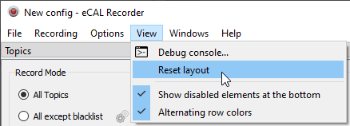
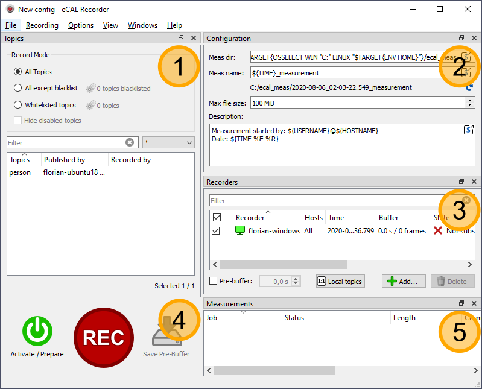
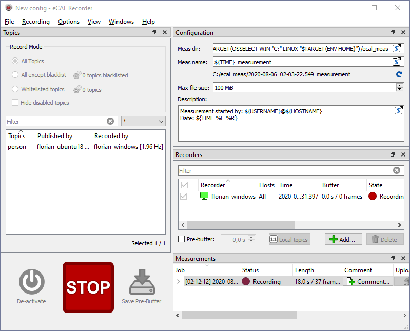
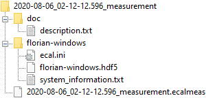

import { Aside } from "@astrojs/starlight/components";
import { Steps } from "@astrojs/starlight/components";
import { Badge } from '@astrojs/starlight/components';

<Aside type="tip">
Don't be afraid to play around with the GUI! If you closed or moved something and can't get it back, just click :guilabel:`View / Reset Layout`!

</Aside>

The eCAL Recorder can record any data that is sent through your eCAL network and save it to disk.
The output of the recorder (-> the recording) is called an **eCAL Measurement**.
You can use that measurement later to analyze it or to stimulate other applications that need that data as input.

<Aside title="See also">
This chapter will focus on the very basics of eCAL Rec to get you started.
To learn more about all features of eCAL Rec, both the GUI and the command line application, please check out the [Advanced eCAL Rec](TODO-LINK) chapter. 
</Aside>

## 6.2.1 Features

The eCAL Recorder is quite powerful, so we will only look at a limited setup in this tutorial.
The eCAL Recorder has two essential modes:

<Steps>
1. **Centralized recording**: Record all topics on your main machine (-> over network).
   This is the most trivial mode and we will use it in this tutorial

2. **Distributed recording**: Each machine records its own topics.
   This mode is used to avoid network congestion.
</Steps>

<Aside title="See also">
   To learn more about centralized and distributed recordings, please refer to the advanced [Centralized vs. Distributed Recordings](TODO-LINK) chapter.
</Aside>

## 6.2.2 GUI Overview

Let's start with a short GUI overview.

- On Windows you can start the eCAL recorder from the Start Menu: `Start / eCAL / eCAL Recorder` 
- On Ubuntu start `ecal_rec_gui` from a terminal

For the screenshot, the Windows machine is running the eCAL Recorder, while the Linux machine is running the *person_snd* sample.

<Steps>
   1. **Topics panel**
      Here you can see all available topics.
      You can select whether to blacklist or whitelist some of them.
      After activating the recorder, you can also see which recorder is recording which topic, which is mainly interesting when using distributed recording.
      As you can see in the screenshot, the recorder has already picked up the *person* topic published by the sample running on *florian-ubuntu*

   2. **Configuration**
      In the configuration panel you can configure the measurement:
      - *Meas dir*: The path where to save your measurements to
      - *Meas name*: How the measurement should be named (This will create a subfolder in your measurement directory).
      You can also enter a description and select the maximum file size.
      If a measurement exceeds the maximum size, it will be splitted to multiple files.
        <Aside>
        Don't be confused by the strange syntax. You can use plain paths (e.g. ``D:\meas\root\dir``) if you like.
        Using the eCAL replacement syntax however solves the problem of having different paths for Windows and Linux machines and timestamped subfolders for each measurement.
        </Aside>

   3. **Active recorders**
      Here you can see all recorder instances and their reported statuses.
      Currently there is only one recorder (florian-windows).
      In a distributed recording configuration however, this panel would display all recorder clients.
      At the bottom of the panel you can activate pre-buffering and set the number of seconds that shall be kept in the buffer.

   4. **Controls**
      In this area are the three main buttons for controlling your recording:
      - <Badge text="Activate" variant="success" size="medium" />: Clicking this button will cause the recorder to create subscribe to the eCAL topics it is supposed to record.
        This will also cause the pre-buffer getting filled.
      - <Badge text="Rec" variant="caution" size="medium" />: This button starts and stops the recording.
        If you haven't clicked *Activate*, this step is done automatically.
        So, unless you care about the pre-buffer function, you don't need to manually activate the recorder.
      - <Badge text="Save Pre-Buffer" variant="note" size="medium" />: This button only becomes active, when you enabled Pre-buffering.
        Clicking it will save the content of the current pre-buffer as a new measurement, without having to click REC and STOP immediately afterwards. 

   5. **Measurement history**
      Whenever you start a recording (either by clicking *REC* or *Save Pre-Buffer*), the measurement is displayed here.
      From this panel you can delete it, add comments to it or upload it to an FTP Server for merging distributed measurements.
</Steps>

## 6.2.3 Let's record some data!

As mentioned above, we have a *person_snd* sample running on a remote machine. Now let's record it!

1. Click <Badge text="Rec" variant="caution" size="medium" /> 
2. Wait some seconds
3. Click <Badge text="Stop" variant="caution" size="medium" />

That's it. You have just created your first eCAL measurement.
Also try adding a comment to your measurement by clicking the <Badge text="Comment..." variant="success" size="medium" /> button in the measurement list!
If you haven't modified the measurement path, it is saved to:

- Windows: `C:\ecal_meas\`
- Linux: `~/ecal_meas/`

## 6.2.4 eCAL Measurements

Before continuing to the next section and replaying the measurement, let's quickly look at what the Recorder has just created:

- <Badge text="doc/description.txt" variant="note" size="medium" />: Your description and your comment is saved in this file
- <Badge text="florian-windows" variant="caution" size="medium" />: Each recorder creates a directory with its hostname for its files. This is important in a distributed measurement scenario, where multiple recorders exist. You will see a directory with your own hostname here.
  - <Badge text="ecal.ini" variant="note" size="medium" />: The configuration file at the time when you started the recorder. Useful for finding configuration issues later.
  - <Badge text="florian-windows.hdf5" variant="note" size="medium" />: The actual recorded data. eCAL records data in the standardized `HDF5 format <https://www.hdfgroup.org/solutions/hdf5/>`_
  - <Badge text="system-information.txt" variant="note" size="medium" />: The same system information that we have seen in the eCAL Monitor. Useful for finding issues later.
- <Badge text="2020-08-06_02-12-12.596_measurement.ecalmeas" variant="note" size="medium" />: "Index-File" that can be opened with the eCAL Player. Does not contain any data by itself.

Now that you know how to record data and have created your first eCAL Measurement continue to the next section and try to replay it with the eCAL Player!
