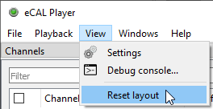
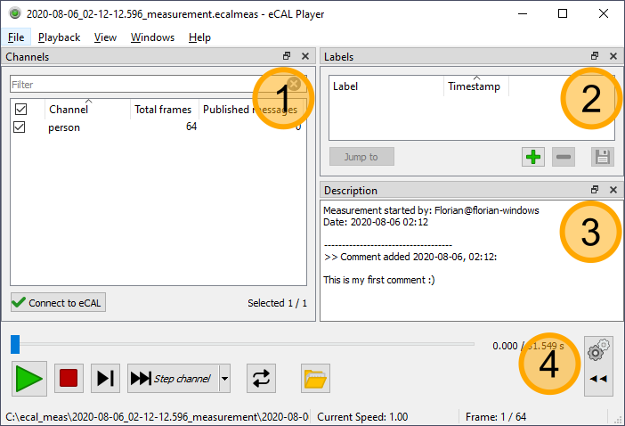
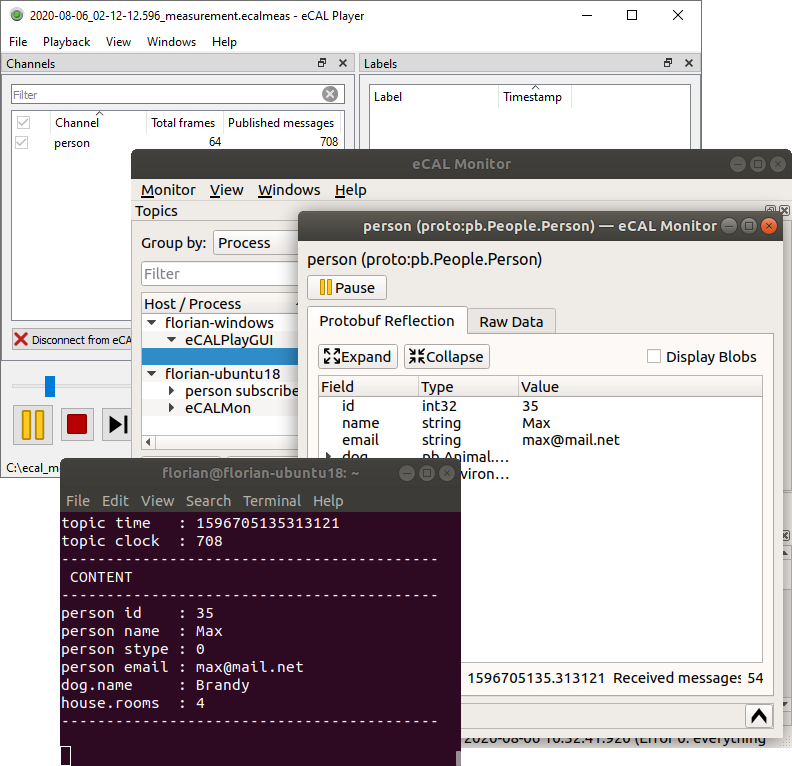

import { Aside } from "@astrojs/starlight/components";
import { Steps } from "@astrojs/starlight/components";
import { Badge } from '@astrojs/starlight/components';

<Aside type="tip">
    Don't be afraid to play around with the GUI! If you closed or moved something and can't get it back, just click <Badge text="View / Reset Layout" variant="note" size="medium" />!
    
    
</Aside>

After you have created an eCAL measurement in the previous section, you now learn how to replay the data. 

So, start the eCAL Player!

- On Windows you can start it from the Start Menu: `Start / eCAL / eCAL Player`
- On Ubuntu start `ecal_play_gui` from a terminal

Also load a measurement, before we get to the GUI overview:

1. Click <Badge text="File / Open measurement..." variant="note" size="medium" />
2. Select the `.ecalmeas` file from your eCAL measurement

## 6.3.1 Overview

<Steps>
   1. **Channels**
    Here you find a list of all topics in the measurement.
    At the moment we only have one topic.
    You can de-select topics here you don't want to be replayed.
    You can also rename topics (from the context menu or by pressing `F2`).

   2. **Labels** 
    If your measurement contains some parts that are of special interest, you can add a label here.
    You can then easily jump to that point later.

   3. **Description**
    The measurement description. You should notice the description and the comment from the previous section.

   4. **Main controls**
    Here you can start / stop the playback, step through the measurement and enable repeat-mode.
</Steps>

## 6.3.2 Replaying the measurement

Click <Badge text="Play" variant="success" size="medium" /> and close any *person_snd* you may still have running.
Open a *person_rec* or an eCAL Monitor and watch the data incoming from the Player!

<Aside type="tip">Activate the repeat-option, so your replay starts over again</Aside>

