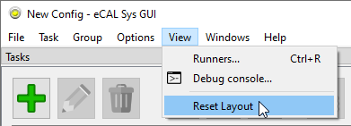
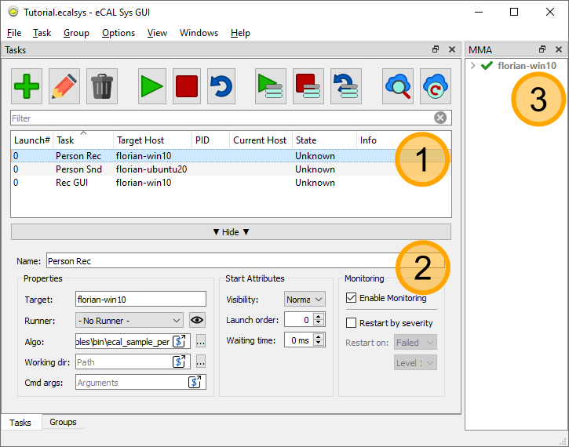
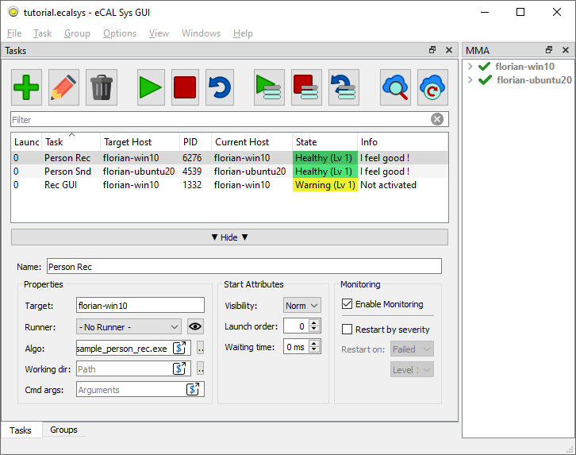

import { Aside } from "@astrojs/starlight/components";
import { Steps } from "@astrojs/starlight/components";
import { Badge } from '@astrojs/starlight/components';
import { Card } from '@astrojs/starlight/components';

<Aside type="tip">
    Don't be afraid to play around with the GUI! If you closed or moved something and can't get it back, just click <Badge text="View / Reset Layout" variant="note" size="medium" />!

    
</Aside>

eCAL Sys is an application for starting, stopping and monitoring applications on one or multiple machines.
You can use it to automatize the startup of your system and check whether any of your applications report an error.

Although you don't really need to use eCAL Sys for starting your eCAL Processes (you can just as well start them manually or create .bat or .sh files), you may find eCAL Sys useful.
eCAL Sys will:

- let you configure, start, stop and restart your applications
- monitor started applications as well as your local and remote PCs
- provide a cross-platform remote-control technique

<Aside>eCAL Sys is available since eCAL 5.8. </Aside>
   
<Aside type="note" title="See also">
This chapter will focus on the very basics of eCAL Sys to get you started.
To learn more about all features of eCAL Sys, both the GUI and the command line application, please check out the [Advanced eCAL Sys](/using_ecal/applications/ecal-sys/introduction/) chapter. 
</Aside>

## 6.4.1 GUI Overview

Let's start eCAL Sys GUI and take a look at it!

- Windows: Start eCAL Sys from the start menu: `Start / eCAL / eCAL Sys`
- Ubuntu: Call ``ecal_sys_gui`` from a terminal or start <Badge text="eCAL Sys" variant="note" size="medium" /> from the App Menu

For the following screenshot, we have already created a few tasks.
We will show you how to do that right after we have taken a look at the GUI.

<Steps>
   1. **Tasks list**
    Here you can see a list of all "tasks" that you have created.
    The term task usually refers to a process, that shall run on either the local or a remote computer.
    Once started, the list also shows the state of all tasks along with an info message.  
    In the screenshot we have already created 3 tasks.
    The person_snd sample will be started on a remote Ubuntu machine.
    The local Windows 10 machine will start the person_rec sample along with the eCAL recorder.

   2. **Configuration Panel**
    In this panel you can edit your Tasks.
    At first you will probably only need the left most settings:  
    **Name**: You can freely choose this name. It is used for displaying only.  
    **Target**: The hostname you want the task to start on.  
    **Runner**: If your tasks e.g. are represented by a .dll or .so file, you can define a runner, that will load that file.  
    **Algo**: The executable to start (or the file that shall be loaded by the runner).  
    **Working dir**: The working directory of your task.  
    **Cmd args**: Additional command line parameters that are passed to the task on start.

   3. **MMA Panel**
    All eCAL Hosts (visible hosts running any eCAL application) are listed here.
    The green arrow indicates whether you can start tasks on this host.
    When the *Machine Monitoring Application* (`ecal_mma /.exe`) is running on that host, it will also display information about the CPU and RAM usage, network traffic etc.
</Steps>

## 6.4.2 Configuring and Starting Tasks

For this tutorial, we are going to use two PCs.
If you don't have a second PC or virtual machine at hand, you can just as well start everything on your host machine. 

eCAL Sys consists of a host- and a client-application.
The GUI (`ecal_sys_gui /.exe`) acts as host, that sends commands to the client.
The client application is `ecal_sys_client /.exe`.
The applications use eCAL Services to communicate, so make sure that you have completed the [Hostname Resolution Tutorial](/getting_started/5_ecal_services/#52-hostname-resolution) from the eCAL Services chapter.

<Aside type="caution" title="Single PC">
   If you don't use a second PC, you don't need the ecal_sys_client.
</Aside>

For starting applications on multiple PCs, you will have to:

1. Start `ecal_sys_gui /.exe` on one machine.
2. Start `ecal_sys_client /.exe` on any other machine than the one you started the GUI on. Make sure to accept the security implications.

<Aside type="danger" title="Important">
   The eCAL Sys Client does not perform any kind auf authentication.
   Any request that is received will be executed, so only use it in networks where you trust all participants.

   If you want to add an extra layer of security, there are existing standards like SSH that should fit your needs.
</Aside>

Now click the <Badge text="Add" variant="note" size="medium" /> button from the toolbar to add some tasks.
Enter the hostnames and commands so that the command can be executed on the respective host.
You may have to modify the hostnames and commands accordingly.

- **Name**: Person Rec
  - **Target**: ``windows-hostname``
  - **Algo**: ``C:\eCAL\samples\bin\ecal_sample_person_rec.exe``

- **Name**: Person Rec
  - **Target**: ``ubuntu-hostname``
  - **Algo**: ``ecal_sample_person_snd``

- **Name**: Rec GUI
  - **Target**: ``windows-hostname``
  - **Algo**: ``C:\eCAL\bin\ecal_rec_gui.exe``

You can download the [Files](#643-files) section below, but you must still check the hostnames and paths.

Now start all tasks by hitting the <Badge text="Start" variant="success" size="medium" /> button from the toolbar!
This will open the Recorder GUI and a person_snd and person_rec sample exchanging data.

Note how the Rec GUI currently reports a warning, because nobody has clicked the *Activate* button, yet!

<Aside type="tip">
   Try stopping or restarting your tasks from the eCAL Sys GUI!
   Also just close one of the applications (the Rec GUI for example) and watch eCAL Sys picking it up as an error.
</Aside>

## 6.4.3 Files

<Card title="Download" icon="document">
    <a href="/src/assets/files/tutorial.ecalsys" download>tutorial.ecalsys</a>
</Card>