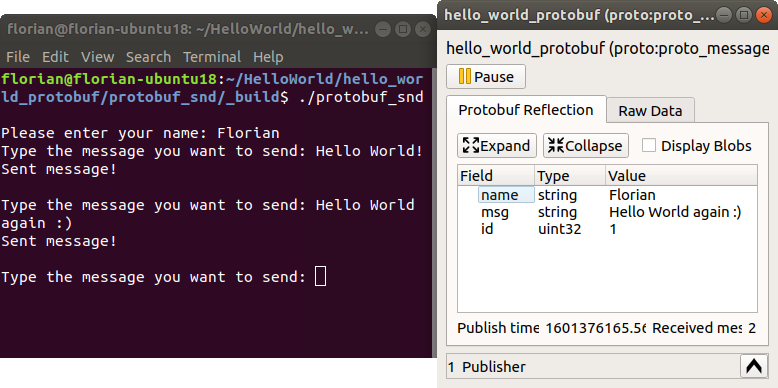
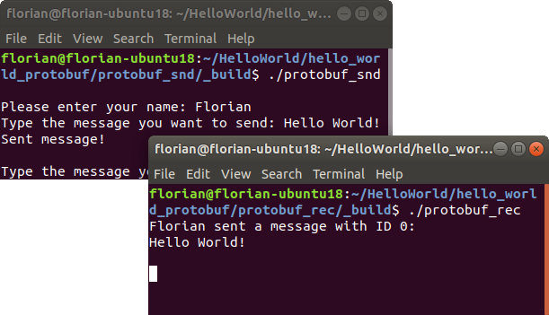

<script src="https://cdnjs.cloudflare.com/ajax/libs/prism/1.24.1/prism.min.js"></script>
<script src="https://cdnjs.cloudflare.com/ajax/libs/prism/1.24.1/plugins/line-numbers/prism-line-numbers.min.js"></script>


import { Aside } from "@astrojs/starlight/components";
import { Icon } from "@astrojs/starlight/components";
import { Code } from 'astro-expressive-code/components';
import { FileTree } from '@astrojs/starlight/components';

import helloWorldPROTO from '../../../../assets/files/hello_world_protobuf/proto_messages/hello_world.proto?raw';

import sndCMakeListsTXT from '../../../../assets/files/hello_world_protobuf/protobuf_snd/CMakeLists.txt?raw';
import sndMainCPP from '../../../../assets/files/hello_world_protobuf/protobuf_snd/main.cpp?raw';

import recCMakeListsTXT from '../../../../assets/files/hello_world_protobuf/protobuf_rec/CMakeLists.txt?raw';
import recMainCPP from '../../../../assets/files/hello_world_protobuf/protobuf_rec/main.cpp?raw';

In the last section you learned how to send strings to an eCAL Topic.
Using strings is great for simple data that has a textual representation.
Quite often however your data will be more complex, so you need some kind of protocol that defines how your data is structured.

Of course, you can define your own protocol and pass the raw memory to eCAL (you would use the raw *eCAL::CPublisher()* to do that).
Our recommended way however is to use Google protobuf, because:

- It solves the problem of how to serialize and de-serialize data for you
- You get downward compatibility out of the box (if you follow the guidelines)
- It is maintained by Google and the API is stable
- The eCAL Monitor can display a nice reflection view of the data

<Aside type="danger" title="Important">
   It is important to remember, that all your applications must agree on the data format.
   As protobuf messages are defined in `.proto` files, all of your applications should be compiled with the same files.
</Aside>

## 7.2.1 Protobuf sender

Let's implement a small application, that lets the user input his name and send a message to an eCAL topic.
As the sender and receiver need the same .proto files, we place them in a separate directory next to the source directories for the sender and the receiver:

<FileTree>
- ‎
    - proto_messages
        - **hello_world.proto**
    - protobuf_snd/
    - protobuf_rec/
</FileTree>

Let's start with the `proto_messages/hello_world.proto` file!

<Code code={helloWorldPROTO} lang="proto" title="hello_world.proto"/>

<Aside title="What is happening here?">
    - **Line 3** assigns a package name (this will appear as C++ namespace later).

    - **Line 5-10** Creates a message "HelloWorld", that holds the fields "name", "id" and "msg".
</Aside>

Now start implementing the actual sender application. Just as in the [last section](/getting_started/7-development-c/7_1_hello_world/) create the `CMakeLists.txt` and `main.cpp` in the `protobuf_snd` directory and paste the following content:

- <Code code={sndCMakeListsTXT} lang="cmake" title="CMakeLists.txt"/>
    <Aside title="What is happening here?">
        - **Line 10** adds Protobuf as dependency
     
        - **Line 16-18** Creates a list of .proto files. We only have one.

        - **Line 22** Compiles the .proto file to a C++ header file (`hello_world.pb.h`). The ``PROTOBUF_TARGET_CPP`` function is a convenience function from eCAL. If you have already worked with Protobuf and CMake, you may be more familiar with the following code, which basically does the same thing:
        ```cmake
            include_directories(${CMAKE_CURRENT_BINARY_DIR})
            protobuf_generate_cpp(PROTO_SRCS PROTO_HDRS ${protobuf_files})
            add_executable(${PROJECT_NAME} ${source_files} ${PROTO_SRCS} ${PROTO_HDRS}) 
        ```

        - **Line 26** links the executable against protobuf
    </Aside>

- <Code code={sndMainCPP} lang="cpp" title="main.cpp" class="line-numbers"/>
    <Aside title="What is happening here?">
        - **Line 2**: This time, we include the protobuf publisher.

        - **Line7** includes the generated C++ file from the :file:`hello_world.proto`

        - **Line 13** creates a protobuf publisher instance. Note that it is templated to ``proto_messages::HelloWorld``, so if you would want to send different messages to different topics, you would create one publisher instance per topic. Sending different messages to the same topic is a bad idea and will break the de-serialization.

        - **Line 32-36** creates the message as protobuf object and sets the fields in it.

        - **Line 38** sends the protobuf object out to the topic.
    </Aside>

Again, you can already watch the sender doing its work by inspecting the topic in the eCAL Monitor!
(Compile the application just as in the [last section](/getting_started/7-development-c/7_1_hello_world/#712-hello-world-publisher))



<Aside type="caution" title="Important">
   The eCAL Monitor will not start listening to messages, until you open the reflection window.
   So, you will only see messages that were sent *after* you have opened the window.
</Aside>

## 7.2.2 Protobuf receiver

- <Code code={recCMakeListsTXT} lang="cmake" title="CMakeLists.txt"/>

- <Code code={recMainCPP} lang="cpp" title="main.cpp"/>
    <Aside title="What is happening here?">
        - **Line 9** is our subscriber callback (you have already seen a callback in the last Hello World Tutorial). This time however it receives a protobuf object.
     
        - **Line 11-13** use the handy protobuf accessor methods to print the data to the terminal.

        - **Line 20** Creates an eCAL protobuf subscriber. Just like the publisher, it is templated to the ``proto_messages::HelloWorld`` message.

        - **Line 23** Sets the callback, so eCAL can call it whenever a new message is received.
    </Aside>   

Now compile and start both the sender and the receiver application and send some messages!



Congratulations, you have completed the Getting Started chapter!
Now go ahead and use eCAL in your real-world scenario.

If you experience issues, you can create a [GitHub issue](https://github.com/eclipse-ecal/ecal/issues_), to get help.

## 7.2.3 Files
<FileTree>
- ‎
    - proto_messages
        - <a href="/src/assets/files/hello_world_protobuf/proto_messages/hello_world.proto" download>hello_world.proto</a>
    - protobuf_snd
        - <a href="/src/assets/files/hello_world_protobuf/protobuf_snd/CMakeLists.txt" download>CMakeLists.txt</a>
        - <a href="/src/assets/files/hhello_world_protobuf/protobuf_snd/main.cpp" download>main.cpp</a>
    - protobuf_rec
        - <a href="/src/assets/files/hello_world_protobuf/protobuf_rec/CMakeLists.txt" download>CMakeLists.txt</a>
        - <a href="/src/assets/files/hhello_world_protobuf/protobuf_rec/main.cpp" download>main.cpp</a>
</FileTree>
