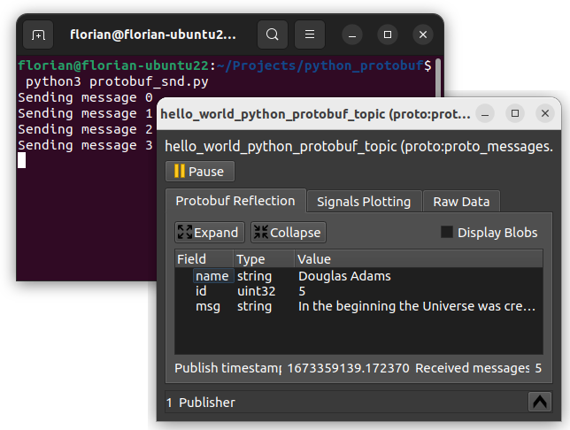
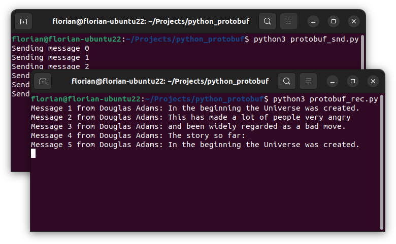

import { Aside } from "@astrojs/starlight/components";
import { Code } from 'astro-expressive-code/components';
import { FileTree } from '@astrojs/starlight/components';

import helloWorldPROTO from '../../../../assets/files/hello_world_python_protobuf/proto_messages/hello_world.proto?raw';

import protobufSndPY from '../../../../assets/files/hello_world_python_protobuf/protobuf_snd.py?raw';
import protobufRecPY from '../../../../assets/files/hello_world_python_protobuf/protobuf_rec.py?raw';

In the last section you learned how to send strings to an eCAL Topic.
Using strings is great for simple data that has a textual representation.
Quite often however your data will be more complex, so you need some kind of protocol that defines how your data is structured.

Our recommended way is to use Google protobuf to do that, because:

- It solves the problem of how to serialize and de-serialize data for you
- You get downward compatibility out of the box (if you follow the guidelines)
- It is maintained by Google and the API is stable
- The eCAL Monitor can display a nice reflection view of the data

<Aside type="caution" title="Important">
   It is important to remember, that all your applications must agree on the data format.
   As protobuf messages are defined in `.proto` files, all of your applications should share the same files.
</Aside>

## 8.2.1 Protobuf in Python

Let's start with creating the protobuf file.
As the sender and receiver need the same .proto files, we place them in a separate directory that will be accessible both for the sender and receiver script.

So, somewhere on your hard drive, create a directory `proto_messages` with a file `hello_world.proto` and paste the following content into that file.

<FileTree>
- ‎
    - proto_messages
        - <a href="/src/assets/files/hello_world_python_protobuf/proto_messages/hello_world.proto" download="hello_world.proto">hello_world.proto</a>
</FileTree>

<Code code={helloWorldPROTO} lang="proto" title="hello_world.proto"/>

<Aside title="What is happening here?">
   - **Line 3** assigns a package name. In Python, the package name is ignored, as python organizes its modules according to their location in the file system.

   - **Line 5-10** Creates a message "HelloWorld", that holds the fields "name", "id" and "msg".
</Aside>

<Aside type="tip">
   1. Specify a package name, even though python doesn't use it.

   2. Keep the package name in sync to the directory structure.

   This makes it easier for you to use the same proto files for C++ and python.
   It also makes it easier to create nested messages (i.e. Protobuf messages that contain other Protobuf messages by importing them based on their package name and message name)
</Aside>

Now you have the description of your message structure.
However, to make it available in python, we need to translate it to a python file.
This is done by the **Protobuf Compiler** (``protoc``).

- On Windows this tool is shipped with eCAL, so if you have eCAL installed, you already got it. If you don't, please [install eCAL](/getting_started/2_installing_ecal/#21-installing-ecal-on-windows). <br/> For running your python script, you don't need to have eCAL installed, even though it may be beneficial e.g. to use eCAL Mon for introspection of your topics.

- On Ubuntu you can easily obtain it standalone from the apt repository:
    ```shell
        sudo apt-get install protobuf-compiler
    ```

Now convert the `.proto` file to a `.py` file on command line.
The command is the same for both Windows and Linux.
```shell
   cd proto_messages
   protoc --python_out=. hello_world.proto
```

If you check the content of the ``proto_messages`` directory, you will now find a file `hello_world_pb2.py`.
This is the file we are going to use in python in the next step.

## 8.2.2 Protobuf Sender

Now let's start implementing the actual python code, that sends some protobuf-serialized data to an eCAL topic.
For that, create a file `protobuf_snd.py` next to your `proto_messages` directory and paste the following content:

<FileTree>
- ‎
    - proto_messages
        - hello_world.proto
    - <a href="/src/assets/files/hello_world_python_protobuf/protobuf_snd.py" download="protobuf_snd.py">protobuf_snd.py</a>
</FileTree>

<Code code={protobufSndPY} lang="python" title="protobuf_snd.py"/>

<Aside title="What is happening here?">
    - **Line 5** imports the Protobuf Publisher from eCAL
   
    - **Line 9** imports the `hello_world_pb2.py` that we just have created.

    - **Line 14** initializes eCAL. The name of the node is "Python Protobuf Publisher".

    - By also providing ``sys.argv`` you get the ability to pass command line arguments to eCAL, e.g. for loading an `ecal.ini` configuration file from a non-standard path. In practice this is not often used and you could also pass ``[]`` as arguments.

    - **Line 20** creates an eCAL Publisher for the topic "hello_world_python_protobuf_topic". The second parameter is the type from our converted "hello_world.proto" message description. By providing the type, eCAL knows how to dynamically deserialize the message.

    - If you would omit passing the type here, you would still be able to receive the messages, but eCAL Mon would only display a boring hexadecimal representation of the content.

    - **Line 35-38** instantiate the protobuf message and fill it with content.

    - **Line 43** sends the entire protobuf message out to all subscribers on the topic.
</Aside>

When you execute the python script, you can now already see the data in the eCAL Monitor!



## 8.2.3 Protobuf Receiver

We know that the sender already works.
So, let's implement a python script that can receive the serialized protobuf data, deserialize it and display the content of the message!

Create a file `protobuf_rec.py` next to the sender and paste the following content:

<FileTree>
- ‎
    - proto_messages
        - hello_world.proto
    - protobuf_snd.py
    - <a href="/src/assets/files/hello_world_python_protobuf/protobuf_rec.py" download="protobuf_rec.py">protobuf_rec.py</a>
</FileTree>

<Code code={protobufRecPY} lang="python" title="protobuf_rec.py"/>

<Aside title="What is happening here?">
    - **Line 5** imports the Protobuf Subscriber from eCAL
   
    - **Line 9** imports the `hello_world_pb2.py` that we have created in the first step.

    - **Line 12 - 15** will be our callback method that is called every time a new message is received on our topic. We will set it as message callback for the eCAL subscriber in **line 29**.

    - **Line 25** creates an eCAL Publisher for the topic "hello_world_python_protobuf_topic". The second parameter is the type from our converted "hello_world.proto" message description. Providing the correct datatype here is crucial for eCAL to automatically de-serialize the data and to provide it to the callback as the correct type.

    - **Line 29** sets our callback as callback method for the eCAL Subscriber.
</Aside>

Now execute both python scripts to see if they work! 



Congratulations, you have completed the Getting Started chapter!
Now go ahead and use eCAL in your real-world scenario.

If you experience issues, you can create a [GitHub issue](https://github.com/eclipse-ecal/ecal/issues), to get help.

## 8.2.4 Files
<FileTree>
- ‎
    - proto_messages
        - <a href="/src/assets/files/hello_world_python_protobuf/proto_messages/hello_world.proto" download="hello_world.proto">hello_world.proto</a>
    - <a href="/src/assets/files/hello_world_python_protobuf/protobuf_snd.py" download="protobuf_snd.py">protobuf_snd.py</a>
    - <a href="/src/assets/files/hello_world_python_protobuf/protobuf_rec.py" download="protobuf_rec.py">protobuf_rec.py</a>
</FileTree>
