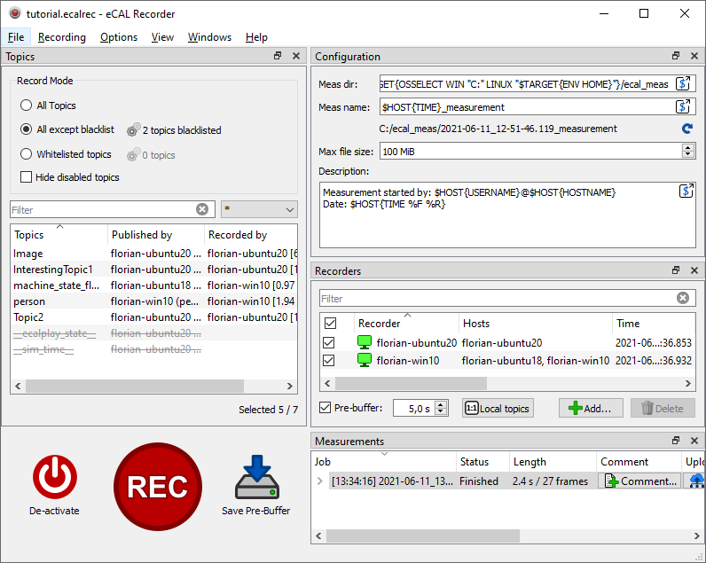
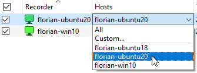
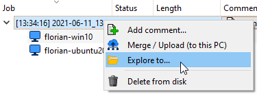
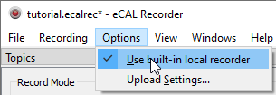
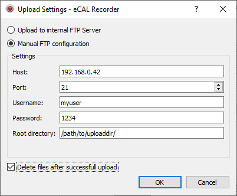

import { Aside } from "@astrojs/starlight/components";
import { Badge } from '@astrojs/starlight/components';
import { Icon } from '@astrojs/starlight/components';

The recorder GUI is the most user friendly application to start recordings and to create `.ecalrec` configuration files.
So, let's walk through it to explain all the feature it has.

<Aside type="tip">
    If you don't want to use the GUI, please see the [eCAL Rec CLI](TODO-LINK) chapter.
</Aside>

## Main Control Panel

- <Badge text="Activate" variant="success" size="medium" /> / <Badge text="Deactivate" variant="danger" size="medium" />:
  Clicking this button will activate and deactivate eCAL Rec.
  For just starting a recording, it is not mandatory to do that manually.

  However, if you have a pre-buffer configured, activating the recorder actually is important.
  Activating will make the recorder create eCAL Subscribers and start buffering data.
  So, if you don't click activate, your pre-buffer will not get filled.

- <Badge text="Rec" variant="danger" size="medium" /> / <Badge text="Stop" variant="danger" size="medium" />: Starts or stop a recording.

- <Badge text="Save Pre-Buffer" variant="note" size="medium" />: Save the content of the pre-buffer to its own measurement.

  This button is only enabled when you have enabled pre-buffering *and* the recorders are activated.
  Basically, this is a shortcut for quickly clicking Rec + Stop.
  However, you can even save the pre-buffer while a recording is running.
  It will not interfere with that.

## Topics

The topics panel on the upper left side has multiple functions:

- It displays all eCAL that are recorded or can be recorded
- It lets you create a black- or whitelist 
- During a recording it shows which topic is recorded by which recorder
  
Note that in a distributed recording environment, the blacklist / whitelist setting is used for all clients.
Having different settings for individual clients is not possible.

<Aside type="tip">
    You can either manage your blacklist / whitelist by clicking the gear icon |ecalicons_SETTINGS| or by right clicking a topic from the list.
</Aside>

## Configuration

The configuration panel lets you configure your global measurement settings.
These settings are used for all new recordings.

- **Meas dir**: The measurement root directory.
  The recorder will create a directory for individual measurements inside this directory.

  If you are using different operating systems, you must make sure the path works for all clients.
  Click the |qecalparser/light_SHOW_DIALOG| button to open an improved editor to help you with the replacement syntax.

  The default is:
  
  - Windows: `C:/ecal_meas/`
  - Ubuntu: `~/ecal_meas/`

- **Meas name**: The name of the directory that is created inside the measurement root directory.

  <Aside type="caution" title="Important">
     You should **always** include a **timestamp** in your measurement name.
     Otherwise multiple measurements will end up in the same directory and may overwrite each other.
  </Aside>

- **Max file size**: The maximum file size of the `.hdf5` files that will be created.
  If the maximum file size is reached, the measurement will be splitted into multiple files.

- **Description**: A general purpose measurement description.
  It will be saved to the `doc/description.txt` file inside each measurement.

## Recorders
  
In this list you can manage your recorder clients and see their status.
This list also shows the state of your recorder addons (if you have any).
If the recorder detects any setting as problematic here, it will show a warning icon <Icon name="warning" />.
Move the mouse over that icon to see what went wrong.

If a client is successfully connected, a green icon is shown.
If something fails, the icon will remain grey.

- For **activating** a client, set the checkmark in the first column.
  By default, only your local PC is checked.
  All machines that have a running ecal_rec_client are shown as available clients.
  In a distributed recording scenario, you would activate the client of all machines that are supposed to record data.

- For **setting which hosts a client shall record**, move the mouse over the host column and expand the dropdown menu that appears.
  By default, each client will record topics from all hosts.
  For a typical distributed recording (each client records the topics from its own host), you would assign each client its own hostname.
  There is a button <Badge text="Local topics" variant="note" size="medium" /> as a shortcut for that.

  

  <Aside type="danger" title="Warning">
     The decision which topics to record is made per-topic and not per-message.
     So, if you have one topic which is published by multiple machines and each machine records all local topics, this topic will be recorded multiple times, as each machine will record all messages (even those sent by other machines).

     Thus, if you plan on using distributed recordings (and you should), you should design your topics accordingly and e.g. publish the data from different machines on different topic names.

     We will fix this inconvenience in the future, but at the moment it is an important thing to take care of.
  </Aside>

- To set a **pre-buffer** activate the checkbox and set the desired value in the field next to it.
  As soon as you have activated the recorder, it will buffer data, even when it is not recorded.
  When starting a recording, the content of the pre-buffer is prepended to the measurement.
  You can see the amount of that that is kept in the buffer in the recorder list.

- With the <Badge text="Add..." variant="success" size="medium" /> and <Badge text="Delete" variant="danger" size="medium" /> buttons you can manage the recorder list, even if the clients on the desired machines are not running, yet.
  This is useful if you want to prepare a configuration and set all recorder settings offline.

  If you are operating on your target system where all clients are already running, you don't really need these buttons.

## Measurements

The measurement list shows all measurement that were created since the recorder has been started along with their state and length.
It also contains two buttons per measurement:

- <Badge text="Comment..." variant="success" size="medium" />: Add a comment to that measurement.
  It will be appended to the `doc/description.txt` file.

- <Badge text="Upload" variant="note" size="medium" />: Upload all measurements to current PC (or another PC, if configured).
  After all clients have finished uploading their files, you will find one directory for each host in your measurement directory.
  When loading a measurement with the eCAl Player, all these host directories are loaded and you will therefore get a monolithic measurement again, even though each client recorded only part of the traffic.
  
  <Aside>
     This button is only enabled, if any other PC has participated in the measurement or you have configured an external FTP Server.
  </Aside>

- **Right-click** a measurement to delete it from all machines or to open a file manager showing the measurement directory.

  

## Options

There are more options available from the menu bar:

- <Badge text="Use built-in local recorder" variant="note" size="medium" />: By default, this option is checked and usually you want to leave it that way.
  If checked, the GUI will not need a separate ecal_rec_client for recording on its own machine.

  

- <Badge text="Upload Settings..." variant="note" size="medium" />: Opens a configuration dialog for the upload settings:
  
  

  - **Upload to internal FTP Sever**: This is selected by default.
    All clients will upload their files to the PC the GUI is running on.

  - **Manual FTP configuration**: Upload to any other FTP Server.
    The FTP Server needs to be accessible from all clients.

  - **Delete after successful upload**: If checked, all clients that have successfully uploaded their part of the measurement will delete the local files.
    This prevents their hard drives to simply fill up over time.