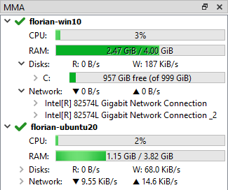

import { Aside } from "@astrojs/starlight/components";
import { Badge } from '@astrojs/starlight/components';
import { Steps } from "@astrojs/starlight/components";

In this chapter we will take a deeper look at eCAl Sys.
We will discuss the Host / Client architecture and eCAL Sys configuration files.

## Sys Applications - Host, Client, MMA

eCAL Sys consists of 2 (or 3) applications:

<Steps>
1. The **Host Application**.
   This can be either one of: 

   - eCAL Sys GUI (`ecal_sys_gui /.exe`)
   - eCAL Sys CLI (`ecal_sys /.exe`)

   The Host Application is started only once on the machine that is supposed to control everything else.
   This application is responsible for loading the configuration file and keeping track of all task states.

   If your main machine is the only machine you want to start tasks on, this is the only application you need.

2. The **Client Application** (`ecal_sys_client /.exe`). 

   The Client Application is started on all machines that shall be remote-controlled.
   It creates an eCAL Service and gets remote-controlled by the eCAL Sys Host Application.

   The eCAL Sys Client is not needed on the machine, where the Host Application is running.

   <Aside>
      The eCAL Sys Client is a remote-control application with no authentication.
      If you are annoyed by accepting this security implication at startup, you can start eCAL Sys Client with:

      ```shell
         ecal_sys_client --auto-accept-security-risk
      ```
    </Aside>

3. The **Machine Monitoring Application** (`ecal_mma /.exe`). 

   This application is not required for eCAL Sys itself.
   However, eCAL Sys will display information about system resources of all systems that run an ecal_mma:

   

   <Aside type="tip">
      You can use eCAL Sys to start the MMA Application, by creating an ``ecal_mma`` task.
   </Aside>
</Steps>

## Configuration Files

eCAL Sys saves configuration files with the ``.ecalsys`` extension.
Those files contain a regular XML description of the configuration.
Although you could write .ecalsys files by hand, it is much easier to use eCAL Sys GUI for that.
The command line application (eCAL Sys CLI) can only load .ecalsys files, but not write them.

<Aside type="tip">
   You can write your paths and command line arguments in a generic way and e.g. use environment variables or do different things based on the host or target operating system.
   eCAL provides a replacement syntax for that and displays an icon where you can use it.

   For instance to use an environment variable ``my_root_dir`` that you have configured differently on each target, use:

   ```shell   
      $TARGET{ENV my_root_dir}/task
   ```

   Click one of the <Badge text="Advanced Editor..." variant="note" size="medium" /> buttons for further information.
</Aside>