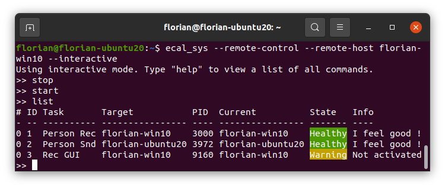

import { Aside } from "@astrojs/starlight/components";
import { Code } from 'astro-expressive-code/components';

import sysCliUsageTXT from '../../../../../assets/files/sys/sys_cli_usage.txt?raw';
import sysCliInteractiveHelpTXT from '../../../../../assets/files/sys/sys_cli_interactive_help.txt?raw';

eCAL Sys can be used purely from command line.
The executable is `ecal_sys /.exe`.
It can execute start / stop / restart commands provided from the command line or as well as from an interactive console.
The interactive mode can also be used to automatize workflows by automatically piping commands to ecal_sys via stdin.

<Aside>
   eCAL Sys CLI cannot create .ecalsys files.
   Please use [eCAL Sys GUI](/using_ecal/applications/ecal-sys/ecal_sys_gui/) for that purpose.
</Aside>

eCAL Sys CLI features two modes:

1. **Direct mode** (default):

   This mode lets you load a configuration and directly start or stop tasks.

2. **Remote control mode**:

   This mode will connect to another eCAL Sys host application (GUI or CLI).
   Commands given to ecal_sys will then be forwarded to the remote-controlled eCAL Sys instance.
   Use this mode when you want to mainly use eCAL Sys manually (e.g. the GUI) but also automatically send commands to it in certain situation.



## Usage

<Code code={sysCliUsageTXT} lang="text" title="sys_cli_usage.txt"/>
   
## Typical use-cases

The following examples are meant as an orientation how to use eCAL Sys.

### Single-shot commands

Loading an .ecalsys file and starting / Stopping all tasks from it:

```shell
   # Start:
   ecal_sys -c ~/tutorial.ecalsys --start

   # Stop:
   ecal_sys -c ~/tutorial.ecalsys --stop

   # Restart:
   ecal_sys -c ~/tutorial.ecalsys --restart
```

<Aside>
   ecal_sys will terminate once the command has been executed.
   Thus, terminating non-eCAL tasks will not work, as the new instance of ecal_sys that is responsible for stopping does not know the Process IDs.
</Aside>

### Interactive mode

Launch the interactive mode to keep eCAL Sys running, while you can directly type commands.
Type ``help`` to view a list of all commands available in interactive mode.

If you combine a single-shot command with the interactive mode, eCAL Sys will continue with the interactive mode after it has executed the command.
eCAL Sys will not terminate on its own.

```shell
   ecal_sys -c ~/tutorial.ecalsys --interactive
```

Available commands are:

<Code code={sysCliInteractiveHelpTXT} lang="text" title="sys_cli_interactive_help.txt"/>

<Aside>
   When starting terminal applications from the interactive mode, their STDOUT and STDERR will be printed in the ecal_sys terminal.
   This makes it *very* hard to enter another command or view information.

   You may want to use another ecal_sys instance in remote-control mode to work around that issue.
</Aside>

### Remote-control eCAL Sys

First you need something that can be remote controlled:

```shell
   # GUI
   ecal_sys_gui ~/tutorial.ecalsys

   # CLI (--interactive Flag will prevent the CLI from exiting)
   ecal_sys -c ~/tutorial.ecalsys --interactive
```

Now you can use another instance of ecal_sys to remote-control that application.
You can use single-shot commands, the interactive mode or both.
In remote-control mode you cannot load an .ecalsys file, as this is done by the main application.

The following command will send the *start* command to your main application and then continue in interactive mode.

```shell
   ecal_sys --remote-control --remote-host YOUR_HOSTNAME --start --interactive
```

### Automatize eCAL Sys CLI

You can use the ecal_sys interactive mode to automatize it via STDIN.
Commands are read line-by-line, i.e. they have to be divided by ``\n``.
Semicolons do not work.
The most concise would probably be to write all your commands in a text file and pipe the content of that to ecal_sys.

- Ubuntu:

  ```shell
     # Commands from command line:
     printf "Start \n Sleep 10 \n List \n Stop \n Sleep 5" | ecal_sys -c ~/tutorial.ecalsys --interactive

     # Commands from a file:
     cat commands.txt | ecal_sys -c ~/tutorial.ecalsys --interactive
  ```   

- Windows CMD.exe:

  ```batch
     rem Commands from command line:
     (echo Start & echo Sleep 10 & echo List & echo Stop & echo Sleep 5) | ecal_sys -c tutorial.ecalsys --interactive

     rem Commands from a file:
     more commands.txt | ecal_sys -c tutorial.ecalsys --interactive
  ```

- Windows PowerShell:

  ```powershell
     # Commands from command line:
     echo "Start `n Sleep 10 `n List `n Stop `n Sleep 5" | ecal_sys -c tutorial.ecalsys --interactive

     # Commands from a file:
     cat commands.txt | ecal_sys -c tutorial.ecalsys --interactive
  ```