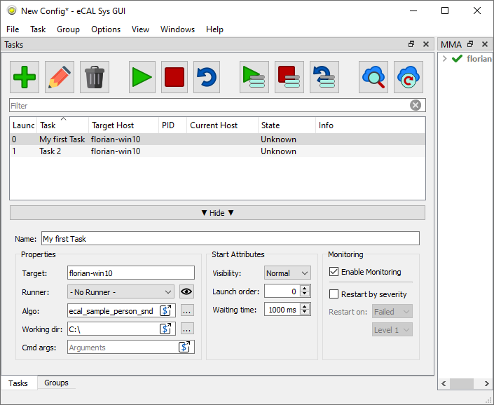
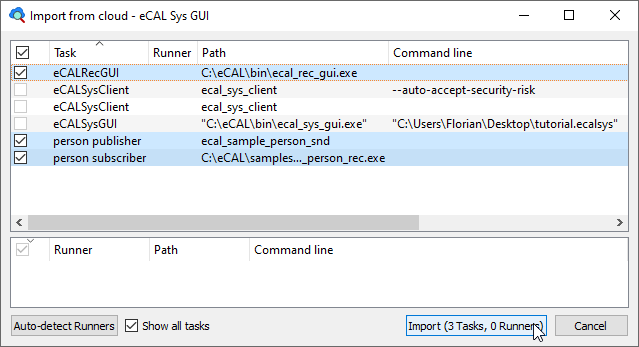
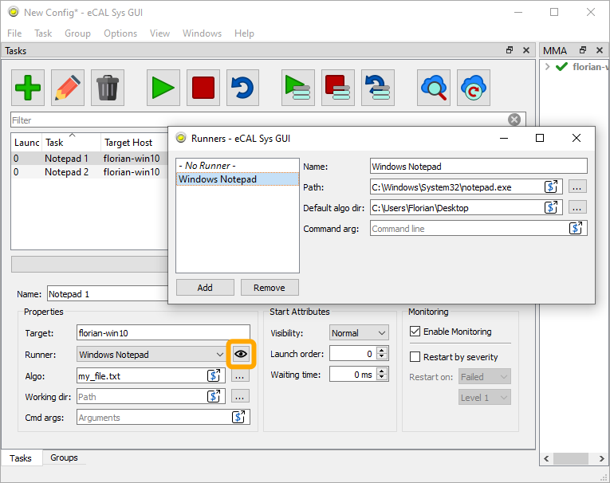
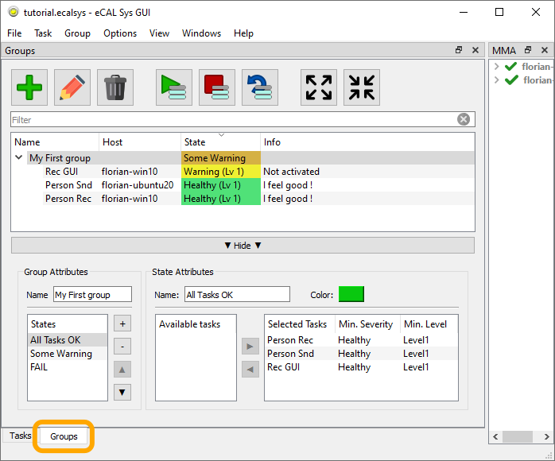
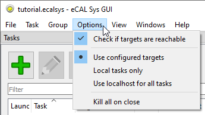
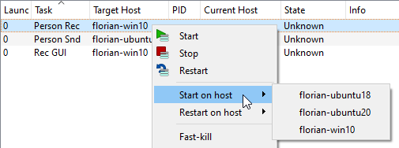

import { Aside } from "@astrojs/starlight/components";
import { Badge } from '@astrojs/starlight/components';

In most cases, the eCAL Sys GUI will be your primary application.
It can both create .ecalsys files and start, stop and monitor your tasks.

So let's look at all of the things you can do with eCAL Sys GUI.



<Aside type="tip">
  If you don't want to use the GUI, please see the [eCAL Sys CLI](TODO-LINK) chapter.
</Aside>

## Toolbar

- <Badge text="Add" variant="success" size="medium" />: Add a new task

- <Badge text="Edit" variant="caution" size="medium" />: Open the edit panel to edit the selected Tasks

- <Badge text="Delete" variant="danger" size="medium" />: Delete the selected tasks

- <Badge text="Start" variant="success" size="medium" /> / <Badge text="Stop" variant="danger" size="medium" /> / <Badge text="Restart" variant="note" size="medium" />:
  Start, stop or restart all your tasks.
  A task that already been started will not be started again.
  If you want a task to run multiple times, you must duplicate it.

  If you only want to start some of your tasks, use the according buttons.

- <Badge text="Import from cloud..." variant="note" size="medium" />:
  This is a function to help you with creating your eCAL Sys configuration.
  Instead of typing all tasks manually in eCAL Sys, you can also start you tasks manually on all of your machines and then click this button.
  You can then select all tasks that you want to appear in your eCAL Sys configuration and import them to replicate the configuration later.

  

- <Badge text="Update from cloud" variant="note" size="medium" />:
  This function tries to match eCAL Processes that are already running to your loaded configuration.
  Use this function, if you e.g. have closed eCAL Sys GUI by accident, as this will cause you to lose the information which tasks have already been started and which PID belongs to them.

  Note that Update from cloud needs a running eCAL Sys Client on all remote machines.

## Task configuration

- **Name**:
  The task name that you can choose freely.
  It is used for displaying in the GUI.
  When using eCAL Sys CLI or controlling eCAL Sys with the eCAL Service, you can also use this name to start / stop / restart tasks by name.

- **Properties**:

  - **Target**:
    The hostname where the tasks shall be started.

  - **Runner**:
    The runner that shall be used for the task.
    Please see the [Runner Section](#runners) below.

  - **Algo**:
    The command you want to have executed on the target.
    Usually this is a path to an executable.

  - **Working dir**:
    If given, the task will be started in this working directory.

  - **Cmd args**:
    Additional arguments that shall be appended to the command line when starting the task

- **Start Attributes**:

  - **Visibility**:
    Whether the window of the started task shall be normal, maximized or minimized.
    Only supported on Microsoft Windows.

    When using a terminal emulator on linux (see [ecal.ini](/using_ecal/configuration/ecal_ini/#process)), the option *minimized* will prevent opening a terminal emulator and the process will print its output in the ecal_sys_client terminal as usual.
    
  - **Launch order**:
    Defines the order of tasks that must be started serialized.
    Tasks with a lower launch order are started first.
    Tasks that share the same launch order may be started in parallel, there are no guarantees about the order.    

  - **Waiting time**:
    How many milliseconds eCAL Sys must wait after starting the task.
    Use this if one of your tasks needs some time for startup and you don't want other tasks being started during that period.
    
    Be aware that other tasks sharing the same launch order are still started in parallel.
    eCAL Sys will schedule the timeout after all tasks with the current launch order number have been started.

- **Monitoring**:

  - **Enable Monitoring**:
    Untick this option to prevent eCAL Sys from displaying the monitoring information.

  - **Restart by severity**:
    Use this option if you want your task to be automatically restarted once it reports an error.
    The task will be killed by means of the operating system.

    If you ever tend to use this option, you should consider writing better tasks.
    It is usually advisable to make the task handle its own error and not kill and restart it.

## Runners

A runner is an executable that you want to execute multiple times with different parameters.
Often a runner will load a file, e.g. a .dll file that it will then execute, but it can just as well only receive command line arguments that modify its behavior.

To manage the runners, you can click <Badge text="View / Runners" variant="note" size="medium" /> or click the EYE icon.



<Aside>
   You can do anything a runner can do with just plain tasks.
   The runners are only there to help you not typing the same path repeatedly.
</Aside>

- **Name**:
  The name of your runner.
  This name will be displayed in the combo box in the task editor.

- **Path**:
  The path to your runner's executable.

- **Default algo dir**:
  The directory where you want the runner to look for the (algo-) file you provide.
  
  Note that this is not the working directory, from which the runner is started!
  If your runner has a default algo dir configured and you enter an algo that is detected to be a relative path, this path will be interpreted to be relative to your default algo path.

- **Command arg**:
  The command that shall be used to load your algo.
  If empty, the algo will simply be appended on the command line.

The example screenshot shows a Windows Notepad Runner, that will look for the files on my Desktop.
There is no Runner command argument.
The given algo (``my_file.txt``) is a relative path, so eCAL Sys will use the default algo dir.
The resulting command line for the selected task (Notepad 1) will be:

```shell
   C:\Windows\System32\notepad.exe "C:\Users\Florian\Desktop\my_file.txt"
```

## Groups

You can create groups of tasks in eCAL Sys to calculate an "overall state".
The groups panel can be reached from the lower tab bar.

As explanation, we will use the ``tutorial.ecalsys`` file from the [Getting Started with eCAL Sys](/getting_started/6-applications/6_4_sys/) chapter.
A group can be created by clicking the <Badge text="Add" variant="success" size="medium" /> button.

<Aside type="tip">
   Download the file and check out how those groups are configured!
</Aside>



- **Group Attributes**:
  
  - **Name**:
    The name of your group.
    This name will be used in the group list.

  - **States**:
    Create states by clicking the <Badge text="+" variant="success" size="medium" /> button.
    eCAL Sys will evaluate your states from top to bottom.
    The first state that meets all its requirements becomes active.
    The active state will be displayed in the group list ("Some Warning" in the screenshot).

    If no state meets its requirements, no state will be active.

- **State Attributes**:

  - **Name**:
    The name of your state, that will be displayed when the state is active.

  - **Color**:
    The color that your state shall appear in, when being active.

  - **Available tasks**:
    A list of all tasks that you have configured.
    Use the :guilabel:`▶` button to move a task to the Selected Tasks list.

  - **Selected Tasks**:
    The list of tasks that are important for the current state.
    Here you must set the minimum severity for all tasks in the state.
    The state becomes active, when all tasks report a severity that is *at least* as good as the minimum severity you have configured.

<Aside type="tip">
   Usually, you want to have an empty state indicating a failure at the end of your state list.
   If no other state is active, this one will always be, as it doesn't have any requirements.

   In the ``tutorial.ecalsys`` file the "FAIL" state is used for that purpose.
   It has an empty "Selected Tasks" list.
</Aside>

## Options

This section is about the <Badge text="Options" variant="note" size="medium" /> available from the menu bar:



- **Check if targets are reachable**:
  When checked, eCAL Sys will check whether there is a running *eCAL Sys Client* on all target machines (except on the current machine, it doesn't need one there).
  When one of the clients is missing, it will prompt a warning.

- **Target overrides**:
  These are "permanent" target overrides, i.e. the options are saved in the .ecalsys file.

  - **Use configured targets**:
    Start tasks on the host you set as target.

  - **Local tasks only**:
    Only start tasks that would have been started on the current machine, anyways.
    Tasks that would have been started remotely are omitted.
  
  - **Use localhost for all tasks**:
    Treat all tasks as if you would have configured them to start on the current machine.

  <Aside type="tip">
     Instead of using these target overrides, you can also temporarily override the target from the context menu!

     
  </Aside>

- **Kill all on close**:
  Forcefully shut down all tasks when you close eCAL Sys GUI.