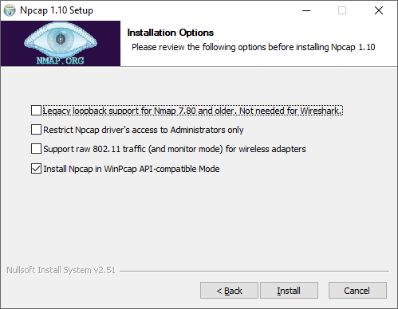
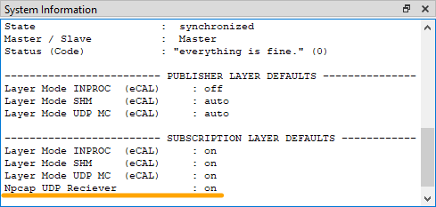
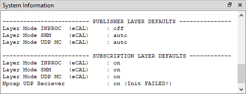
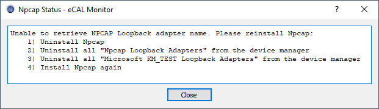

import { Aside } from "@astrojs/starlight/components";
import { Badge } from '@astrojs/starlight/components';
import { Steps } from "@astrojs/starlight/components";

When using eCAL on Windows 10, you may experience a slowdown of the entire operating system.
The mouse curser will stutter, your eCAL processes will not run smooth any more and they may even disappear in the eCAL Montior.

The issue is causes by a security feature in the Windows Defender, which causes massive CPU load when encountering UDP Multicast traffic.
Windows 7 did not have that issue.

Although the problem is not caused by eCAL, eCAL can work around it by using Npcap for receiving UDP Multicast packages. 

If you want to learn more details, please read the [original analysis](TODO-LINK) of the problem.

<Aside>
   As Ubuntu doesn't have that issue, the NPCAP mode is not available there
</Aside>

## How to use Npcap

<Steps>
1. Download Npcap: https://nmap.org/npcap/

2. Install Npcap with default options
    
    <Aside>
        As of eCAL 5.7.8 and 5.8.3, eCAL does not need the legacy loopback adapter option any more.

        If you want to use an older Version of eCAL, you have to:
      
        - Download an old version of NPCAP: [NPCAP 0.9996](https://nmap.org/npcap/dist/npcap-0.9996.exe)
        - Select the "Legacy loopback support" when installing NPCAP
    </Aside>
      

3. Edit `C:\ProgramData\eCAL\ecal.ini`:
    ```ini   
        npcap_enabled = true
    ```    

4. Check eCAL Mon
    
</Steps>

## Troubleshooting

If you enable Npcap but didn't install it, installed it with the wrong settings or your installation is broken, eCAL Mon will tell you that the Npcap Initialization has failed.
eCAL will still work, but not use Npcap.

The System Information will display an error.
The detailed error can be seen in the eCAL Monitor under <Badge text="View / Npcap Status" variant="note" size="medium" />:





Especially old versions of Npcap seems to break itself if you reinstall it, as the uninstaller does not remove the Loopback Adapter properly.
The new Npcap installation will fail to create a new Loopback Adapter and the installation will be corrupt!

Please do a clean install of Npcap:

1. Uninstall Npcap
2. Manually uninstall all Npcap Loopback Adapters using the Windows device manager.
3. Manually uninstall all Microsoft KM-TEST Loopback adapters with the device manager
4. Install Npcap again with the settings above
